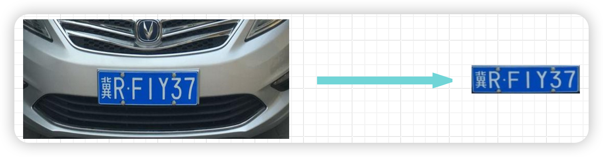

## License plate recognition process description document

The overall process is mainly divided into two major steps:
- 1. Use multiple algorithms to extract the outline of the license plate, obtain the license plate cut-out from the original image according to the outline, and use the SVM algorithm model to determine whether the cut-out is a license plate
- 2. Determine the color of the license plate based on the license plate cut-out, and use the contour extraction algorithm to extract the license plate character outline, and obtain the license plate cut-out from the binary image according to the outline; use the ANN algorithm model to use the Chinese character model, blue license plate model, and green license plate model to recognize the text content of the character cut-out

|  |
| :----------------------------------------------------------: |

### License plate block extraction
The purpose is to extract the block containing the license plate from the license plate image; there are three implementation methods:
- 1. Contour extraction algorithm
- 2. Color segmentation extraction algorithm
- 3. Feature recognition extraction algorithm

|  |
| :----------------------------------------------------------: |

#### 1. Contour extraction algorithm
The main image processing process is as follows:

|  |
| :----------------------------------------------------------: |

```
- Read the image, convert the size, and then grayscale the image;
- Gaussian blur, remove noise;
- Sobel operation, detect image edges
- Image binarization, convert the edges to white (value 255), and other content to black (value 0)
- Image closing operation, merge adjacent edge lines into blocks
- Edge erosion operation, remove some small connecting lines and separate some large block areas
- Edge expansion, restore the size of the block area affected by the erosion operation
- Restore the image to the original image size, extract the contour according to the binary image
- Cut the image from the original image according to the extracted contour
- Adjust the obtained cut image to a fixed size: 136*36 pixels, used for the SVM algorithm model to determine whether it is a license plate
```
- The above operation steps will also include some other small steps, such as: contour screening, image rotation correction, etc.
- This method can be said to be more universal. Adjusting some parameters of each step by yourself can also greatly increase the recognition accuracy in specific scenarios

---------------------------

#### 2. Color segmentation extraction algorithm

The main image processing process is as follows:

|  |
| :----------------------------------------------------------: |

```
- Convert to HSV color space, filter the hsv value range (value range, you can use my color cutting tool, roughly locate);
- The operation steps for blue, green and yellow plates are basically the same, the only difference is that the HSV value range is different
- Image equalization, enhance contrast
- Image binarization, get the license plate area
- Image closing operation, connect the license plate area into a piece
- Restore the image to the original image size, extract the contour based on the binary image
- Cut the image from the original image based on the extracted contour
- Adjust the obtained cut image to a fixed size: 136*36 pixels, used for the SVM algorithm model to determine whether it is a license plate
```
- The above steps will also include some other small steps, such as: contour screening, image rotation correction, etc.
- This method has a relatively high recognition accuracy in specific scenarios

---------------------------

#### 3. Feature recognition and extraction algorithm

The main image processing process is as follows:

|  |
| :----------------------------------------------------------: |

```
- Use the harrcascade model to directly identify the position of the tiles in the image and extract the tile cut
- Adjust the obtained cut to a fixed size: 136*36 pixels, which is used in the SVM algorithm model to determine whether it is a license plate
```

- This method should be widely used, and face recognition also often uses this method
- There are many algorithms for feature recognition, and the harr algorithm is relatively old-fashioned

---------------------------

### License plate character recognition
The purpose is to identify the color and number of the license plate from the license plate block

|  |
| :----------------------------------------------------------: |

#### Image debugging process
|  |
| :----------------------------------------------------------: |

```
- Use the SVM model algorithm to determine whether the block is a license plate
- Convert the block to the HSV color space, and after the image is equalized, calculate the color of the license plate according to the value range and proportion of H
- Grayscale and Gaussian blur of the original image
- Then directly binarize; for license plates, it usually only contains two colors
- Edge corrosion, expansion
- Horizontal or vertical projection to remove borders, rivet interference, etc.
- Miscut correction
- Contour extraction, contour position, size correction, contour filtering, etc.
- Extract character blocks, adjust to a uniform size of 20*20 pixels, use ANN algorithm to identify the characters of the blocks, calculate confidence, etc.
```
