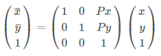
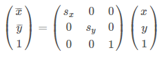
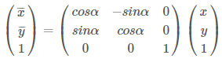
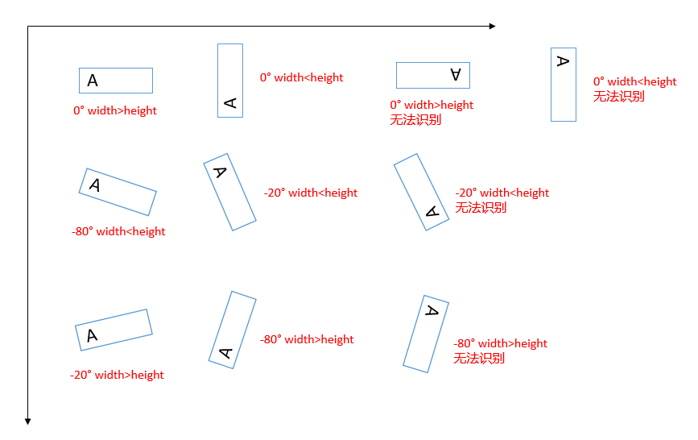
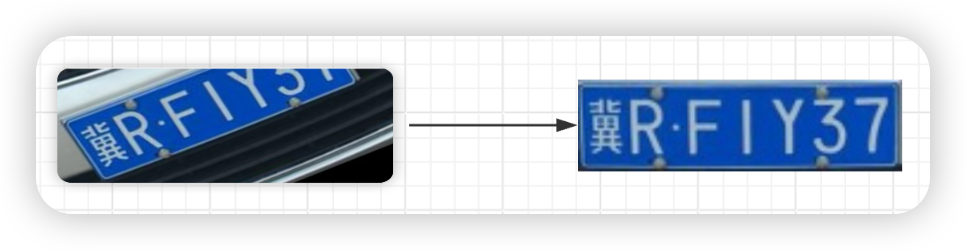
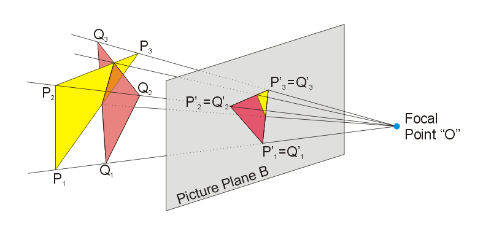
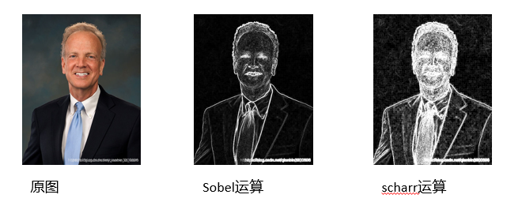

# License Plate Recognition Algorithm Explanation Document
## Image channel
In OpenCV, images can be represented as channels 1, 2, 3, and 4, respectively
- Channel 1 is a grayscale image;
- The 2-channel images are RGB555 and RGB565. The 2-channel diagram may be used in program processing, such as Fourier transform, where one channel is a real number and the other is an imaginary number, mainly for ease of programming. RGB555 is 16 bits, 2 bytes, 5+6+5. The first 5 bits of the first byte are R, the last 3 bits plus the second byte are G, and the last 5 bits of the second byte are B. It can be seen that the original image has been compressed
- 3-channel color image (RGB);
- 4 channels are RGBA, which is RGB plus an A channel, also known as alpha channel, representing transparency. PNG images are a typical type of 4-channel image. The alpha channel can be assigned values from 0 to 1 or from 0 to 255, indicating transparency to opacity
CvType type constant combination rules
- Byte: number of bits, digits. There are 8 bytes, 16 bytes, 32 bytes, and 64 bytes; In Mat, the space occupied by each pixel is 8 bits, which is CV_8
- U|S|F ：
  - U: unsigned int, unsigned integer
  - S: signed int, signed integer
  - F: float, single precision floating-point type, float type itself has a sign
  The terms signed and unsigned here refer to binary encoding of images. In the process of writing, I mostly use unsigned symbols, namely CV_8U and CV_16U, when there is calculation involved
  - C [channels]: The number of channels in an image
  **For example, CV_8UC3 is an 8-bit unsigned 3-channel (RGB color) image**
  ##Grayscale image
  - Color images usually include three components: R, G, and B. Grayscale conversion is the process of making the R, G, and B components of a color image equal**
  - Each pixel in a grayscale image has only one sample color, and its grayscale is a multi-level color depth located between black and white,
  - Pixels with higher grayscale values are brighter, while those with lower grayscale values are darker. The maximum pixel value is 255 (representing white) and the minimum pixel value is 0 (representing black)
- `Imgproc.cvtColor(inMat,  dst, Imgproc.COLOR_BGR2GRAY);`
-  https://leejason.blog.csdn.net/article/details/106416128
   ## Image filtering (noise reduction)
   - Image filtering, which suppresses the noise of the target image while preserving its detailed features as much as possible, is an indispensable operation in image preprocessing. The quality of its processing effect will directly affect the effectiveness and reliability of subsequent image processing and analysis
   - There are two types of purposes: * * one is vague; Another type is to eliminate noise**
   ### Gaussian filtering
   Also known as Gaussian blur, the principle of blur:
   - Take a matrix (3X3, 5X5) and convolve it with the original image from left to right and top to bottom. Finally, assign the convolution value to the center pixel of the current convolution
   - The size and value of a matrix are commonly referred to as convolution kernels
   - Used to suppress noise, smooth images, and prevent detecting noise as edges
   - Compared to mean filtering, Gaussian filtering has a smaller degree of blur in images
```java
Public static final int BLUR-KERNEL=3;//The size of the filtering kernel must be a positive odd number
public static void gaussianBlur(Mat inMat, Mat dst) {
Size ksize=new Size (BLUR-KERNEL, BLUR-KERNEL);//3x3//Gaussian filter kernels can have different widths and heights, but they must all be positive odd numbers
Imgproc.GaussianBlur(inMat,  dst, ksize, 0, 0, Core.BORDER_DEFAULT);
}
```
https://blog.csdn.net/qq_35294564/article/details/81142524
### Median filtering
Replacing the grayscale value of a pixel with the median grayscale value in the pixel domain means replacing all values with the median value of a region. Can * * exclude the maximum and minimum values**
- Removing speckle noise and salt and pepper noise is very useful. Mean filtering noise is also involved in the operation
- The median filtering time is more than 5 times that of the mean filtering
```java
Public static final int BLUR-KERNEL=3;//The size of the filtering kernel must be a positive odd number
public static void medianBlur(Mat inMat, Mat dst) {
Size ksize = new Size(BLUR_KERNEL, BLUR_KERNEL); //3x3
Imgproc.MedianBlur(inMat,  dst, ksize, 0, 0, Core.BORDER_DEFAULT);
}
```
### Mean filtering
The mean filtering itself has inherent flaws, that is, it cannot protect image details well, and at the same time, it destroys the details of the image while denoising, making the image blurry and unable to remove noise points well. Especially the salt and pepper noise
```java
Public static final int BLUR-KERNEL=5;//The size of the filtering kernel must be a positive odd number
public static void blur(Mat inMat, Mat dst) {
Point anchor = new Point(-1,-1);
Size ksize = new Size(BLUR_KERNEL, BLUR_KERNEL);
Imgproc.blur(inMat,  dst, ksize, anchor, Core.BORDER_DEFAULT);
}
```
## Affine transformation
The general operations for changing images include zooming in, zooming out, rotating, etc., collectively referred to as * * geometric transformations * *; The main image transformations include affine transformation, projection transformation, and polar coordinate transformation;
There are two main steps in transforming an image:
- Implementing the transformation of spatial coordinates means moving the image from its initial position to its final position**
- Use an interpolation algorithm to complete the grayscale value of each pixel in the output image**
- INTER-NEAREST nearest neighbor interpolation
- INTER_LINEAR bilinear interpolation (default)
- When using pixel region relationships for resampling, downsampling, and image reduction in INTER_AREA, it is used
- INTER_CUBIC 4x4 pixel neighborhood bicubic interpolation * * used when enlarging * * images
- Lanczos interpolation of INTER_LANCZOS4 8x8 pixel neighborhood
### Translate
Translation is the simplest affine transformation; If the spatial coordinates (x, y) are moved 100 along the x-axis and 200 along the y-axis. The translated coordinates are (x+100, y+200)
After generalizing this process, assume that any spatial coordinate (x, y) is first translated along the x-axis by Px and then along the y-axis by Py. The obtained coordinates are (x+Px, y+Py).
The translation process can be represented by a matrix as follows:

|  |
| :-----------------------------------------------: |

Namely: ` dst=A * inMat ` A is an affine matrix
```java
/**
*@ param pX moves pixels horizontally; If it is greater than 0, it indicates positive movement along the axis; if it is less than 0, it indicates negative movement along the axis
*@ param pY moves pixels vertically; If it is greater than 0, it indicates positive movement along the axis; if it is less than 0, it indicates negative movement along the axis
*/
public static void translateImg(Mat inMat, Mat dst, int pX, int pY){
//Define a translation matrix to create a fully zero matrix with 2 rows and 3 columns;
//Normally, it should be 3 × 3, but the value of the last line has been fixed to 0 0 1
Mat trans_mat = Mat.zeros(2, 3, CvType.CV_32FC1);
trans_mat.put(0, 0, 1);
trans_mat.put(0, 2, pX);
trans_mat.put(1, 1, 1);
trans_mat.put(1, 2, pY);
//Affine transformation size: If inMat is used, the original canvas size will be maintained. If dst size is used, the canvas size can be adjusted by oneself
Imgproc.warpAffine(inMat, dst, trans_mat, inMat.size()); 
}
```
If the inMat and its radiation transformed dstMat matrix are known to calculate the transformed coordinates, the calculation of the radiation matrix is required,
The main implementation methods include equation method, matrix method, and interpolation algorithm
### Zoom in and out
The images collected by general devices have relatively large pixels** High pixel count can result in excessively long computation time; You can consider reducing the image for related calculations
Attention: * * The image scaling algorithm may cause slight deformation of the license plate and reduce clarity * *, affecting the calculation results
Solution to deformation:
- Lock the aspect ratio to zoom in and out
- After extracting the contour, restore the contour image to its original size, and then extract the license plate cutout from the original image

|  |
| :---------------------------------------------: |


```java
/**
*Calculate the zoom in/out ratio based on the maximum width
*Lock aspect ratio
*/
public static Mat zoom(Mat inMat, Integer maxWidth){
Double ratio = maxWidth * 1.0 / inMat.width();
Integer maxHeight = (int)Math.round(ratio * inMat.height());
Mat dst = new Mat(maxHeight, maxWidth, inMat.type());
zoom(inMat,  dst, ratio, ratio, debug, tempPath);
return dst;
}
/**
*Unlock aspect ratio
*@ param x horizontal transformation ratio; If it is greater than 1, enlarge; if it is less than 1, shrink
*@ aram y vertical transformation ratio; If it is greater than 1, enlarge; if it is less than 1, shrink
*/
public static void zoom(Mat inMat, Mat dst, Double x, Double y){
Mat trans_mat = Mat.zeros(2, 3, CvType.CV_32FC1);
trans_mat.put(0, 0, x);
trans_mat.put(1, 1, y);
Imgproc.warpAffine(inMat, dst, trans_mat, dst.size()); //  affine transformation 
}
```
`warpAffine(Mat src,  Mat dst, Mat M, Size dsize, int flags, int borderMode, Scalar borderValue)`
The default values for warp are: int flags=INTER_LINEAR, int borderMode=BORDER-CONSTANT, Scalar borderValue=Scalar()
Using radial transformation * * Imgproc. warpAffine, which is actually the same as Imgproc. resize * *, can be interpolated through parameter selection algorithm;
```java
/**
*Zoom in and out of the image, lock the aspect ratio
*/
public static Mat zoom(Mat inMat, Integer maxWidth) {
Double ratio = maxWidth * 1.0 / inMat.width();
Integer maxHeight = (int)Math.round(ratio * inMat.height());
Mat dst = new Mat(maxHeight, maxWidth, inMat.type());
If (ratio>1.0) {//INTER_CUBIC is used when zooming in on an image
Imgproc.resize(inMat, dst, dst.size(),  ratio, ratio, Imgproc.INTER_CUBIC);
}Use 'else {//INTER_AREA' when reducing the image
Imgproc.resize(inMat, dst, dst.size(),  ratio, ratio, Imgproc.INTER_AREA);
}
return dst;
}
```
`resize(Mat src,  Mat dst, Size dsize, double fx, double fy, int interpolation)`
- Scale factors of fx and fy along the x-axis and y-axis
```
When the input parameters fx and fy are zero, the default values are calculated as follows:
double fx = resized.cols() * 1.0 /inMat.cols();
double fy = resized.rows() * 1.0 /inMat.rows();
```
- Interpole insertion method
```
-INTER-NEAREST nearest neighbor interpolation
-INTER_LINEAR bilinear interpolation (default)
-When using pixel region relationships for resampling and reducing images, INTER_AREA uses
-When using bicubic interpolation to enlarge images in the 4x4 pixel neighborhood of INTER_CUBIC
-Lanczos interpolation of INTER_LANCZOS4 8x8 pixel neighborhood
```
### Rotate

|  |
| :---------------------------------------------: |

**If the angle of rotation is greater than 0, it is clockwise; if it is less than 0, it is counterclockwise**
```java
public static void rotateImg(Mat inMat, Mat dst, double angle, Point center){
Mat imd_rotated=Imgproc. getRotationMatrix2D (center, angle, 1);//Get the rotation matrix
Imgproc.warpAffine(inMat, dst, img_rotated, inMat.size());
}
```
Contour extraction, obtaining the minimum bounding rectangle, rotating the horizontal axis of the image counterclockwise. When it is first parallel to the rectangle, the parallel edge is the width of the rectangle, and the angle between this edge and the horizontal direction is the angle; So after extracting the oblique rectangle, it is necessary to determine the length of the width and height sides
When rotating a corrected image, you can rotate it according to the angle of the oblique rectangle, as follows:

|  |
| :---------------------------------------------: |

### Wrong cut

|  |
| :----------------------------------------------------------: |

Take three points from the original image, calculate the transformed three points to obtain the transformation matrix, and then transform the original image
As shown in the license plate image above, the minimum bounding rectangle of the license plate contour is obtained before conversion. After conversion, the width of the bounding rectangle should be reduced by the corresponding pixels, otherwise the rectangle will be too large and the extracted license plate will not be accurate
```java
public static void warpPerspective(Mat inMat, Mat dst){
//Original image four three vertices
MatOfPoint2f srcPoints = new MatOfPoint2f();
srcPoints.fromArray(new Point(0, 0), new Point(0, inMat.rows()), new Point(inMat.cols(), 0));
//Three vertices of the target graph
MatOfPoint2f dstPoints = new MatOfPoint2f();
dstPoints.fromArray(new Point(0 + 80, 0), new Point(0 - 80, inMat.rows()), new Point(inMat.cols() + 80, 0));
Mat trans_mat=Imgproc. getAffineTransform (srcPoints, dstPoints);//Transform matrix
Imgproc.warpAffine(inMat, dst, trans_mat, inMat.size()); 
}
```
###Projection transformation
Also known as perspective transformation; It is to project the image onto a new viewing plane
Just like playing a film movie, there is a light source that illuminates the film and produces a projection on the screen; As the position of the light source changes, the projection on the screen also changes accordingly

|  |
| :---------------------------------------------: |

Take four points from the original image inMat, calculate the transformed four points to obtain the transformation matrix, and then transform the original image
Here, taking the four vertices of the original image as an example
```java
public static void warpPerspective(Mat inMat, Mat dst){
//The four vertices of the original image
MatOfPoint2f srcPoints = new MatOfPoint2f();
srcPoints.fromArray(new Point(0, 0), new Point(0, inMat.rows()), 
new Point(inMat.cols(), 0), new Point(inMat.cols(), inMat.rows()));
//The four vertices of the target graph
MatOfPoint2f dstPoints = new MatOfPoint2f();
dstPoints.fromArray(new Point(0 + 80, 0), new Point(0 - 80, inMat.rows()), 
new Point(inMat.cols() + 80, 0) , new Point(inMat.cols() - 80, inMat.rows()));
Mat trans_mat=Imgproc. getPerspectiveTransform (srcPoints, dstPoints);//Transform matrix
Imgproc.warpPerspective(inMat, dst, trans_mat, inMat.size()); //  Projection transformation
}
```
Compared to the misalignment correction of affine transformation, the misalignment correction is a three-point method and the projection transformation is a four point method. For license plate image processing, the two methods have similar effects, but the three-point method has higher execution efficiency**
### Reference Documents
https://www.cnblogs.com/supershuai/p/12317652.html
## Edge detection

|  |
| :---------------------------------------------------: |

### Sobel operation
-Also known as Sobel operator, edge detection operator
-It is a first-order gradient algorithm; Perform derivative operations on pixels in the image to obtain the first-order horizontal derivative of the image; Thus obtaining the difference value between adjacent two pixels**
-It has the function of smoothing noise and providing more accurate edge direction information, but the edge positioning accuracy is not high enough.
-When the precision requirement is not very high, it is a commonly used edge detection method
```java
public static final int SOBEL_SCALE = 1;
public static final int SOBEL_DELTA = 0;
public static final int SOBEL_X_WEIGHT = 1;
public static final int SOBEL_Y_WEIGHT = 0;
Public static final int SOBEL-KERNEL=3;//Kernel size must be odd and not greater than 31
Public static final double alpha=1.5;//multiplier factor
Public static final double beta=10.0;//offset
public static void sobel(Mat inMat, Mat dst) {
Mat grad_x = new Mat();
Mat grad_y = new Mat();
Mat abs_grad_x = new Mat();
Mat abs_grad_y = new Mat();
//Calculate the absolute value of the horizontal grayscale gradient
Imgproc.Sobel(inMat,  grad_x, CvType.CV_8U, 1, 0, SOBEL_KERNEL, SOBEL_SCALE, SOBEL_DELTA, Core.BORDER_DEFAULT); 
Core.converrtScaleAbs (grad-x, abs_grad-x, alpha, beta);//Enhance contrast
//Calculate the absolute value of the vertical grayscale gradient
Imgproc.Sobel(inMat,  grad_y, CvType.CV_8U, 0, 1, SOBEL_KERNEL, SOBEL_SCALE, SOBEL_DELTA, Core.BORDER_DEFAULT);
Core.convertScaleAbs(grad_y,  abs_grad_y, alpha, beta);
//Calculate the gradient of the results
Core.addWeighted(abs_grad_x,  SOBEL_X_WEIGHT, abs_grad_y, SOBEL_Y_WEIGHT, 0, dst);
}
```
### Schrarr operation
The Schrarr operator will bring more edge details to the image
```java
public static void scharr(Mat inMat, Mat dst) {
Mat grad_x = new Mat();
Mat grad_y = new Mat();
Mat abs_grad_x = new Mat();
Mat abs_grad_y = new Mat();
//When calculating gradients, we use the Scharr algorithm, while the Sofia algorithm is susceptible to interference from image details
Imgproc.Scharr(inMat,  grad_x, CvType.CV_32F, 1, 0);
Imgproc.Scharr(inMat,  grad_y, CvType.CV_32F, 0, 1);
//The CvType with 32-bit floating-point numbers in openCV is used to store pixel data values that may be negative values
Core.convertScaleAbs(grad_x, abs_grad_x);
Core.convertScaleAbs(grad_y, abs_grad_y);
//Release Mat class images using release() and BitMap class images using cycle() in openCV
grad_x.release();
grad_y.release();
Core.addWeighted(abs_grad_x, 0.5,  abs_grad_y, 0.5, 0, dst);
abs_grad_x.release();
abs_grad_y.release();
}
```
## Image binarization
### Binary optimal threshold calculation
### Binary calculation
### Close operation
### Edge corrosion, edge expansion
## Contour extraction
